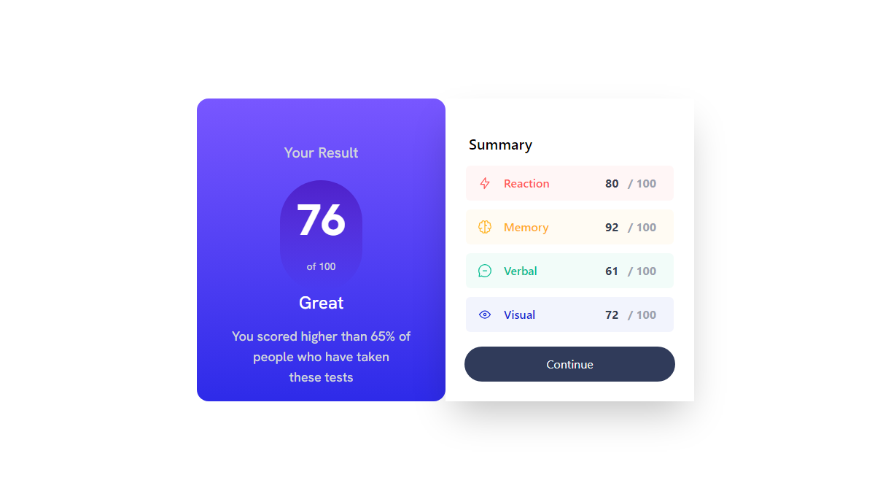
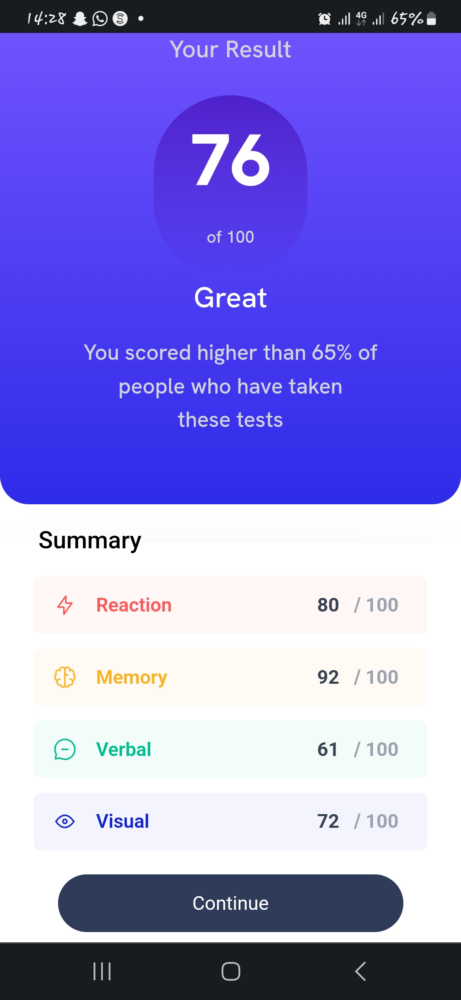

# Frontend Mentor - Results summary component solution

This is a solution to the [Results summary component challenge on Frontend Mentor](https://nifix001-results-summary-component.netlify.app/). Frontend Mentor challenges help you improve your coding skills by building realistic projects. 

## Table of contents

- [Overview](#overview)
  - [The challenge](#the-challenge)
  - [Screenshot](#screenshot)
  - [Links](#links)
- [My process](#my-process)
  - [Built with](#built-with)
  - [What I learned](#what-i-learned)
  - [Continued development](#continued-development)
  - [Useful resources](#useful-resources)
- [Author](#author)
- [Acknowledgments](#acknowledgments)

**Note: Delete this note and update the table of contents based on what sections you keep.**

## Overview

### The challenge

Users should be able to:

- View the optimal layout for the interface depending on their device's screen size
- See hover and focus states for all interactive elements on the page
- **Bonus**: Use the local JSON data to dynamically populate the content

### Screenshot




**Note: Delete this note and the paragraphs above when you add your screenshot. If you prefer not to add a screenshot, feel free to remove this entire section.**

### Links

- Solution URL: [Add solution URL here](https://nifix001-results-summary-component.netlify.app/)
- Live Site URL: [Add live site URL here](https://nifix001-results-summary-component.netlify.app/)

## My process

### Built with

- Semantic HTML5 markup
- CSS custom properties
- Flexbox
- CSS Grid
- Mobile-first workflow
- [React](https://reactjs.org/) - JS library
- [Tailwind CSS](https://tailwindcss.com/) - For styles

**Note: These are just examples. Delete this note and replace the list above with your own choices**

### What I learned

I learnt how to use TailwindCSS more through the use of tailwind Docs, most expecially the aspect of responsiveness. I also learnt how to use Javascript forLoop on a project.


To see how you can add code snippets, see below:

```html
<div className="lg:max-2xl:h-full lg:max-2xl:w-1/2 lg:max-2xl:rounded-x-2xl shadow-2xl py-4 px-4"></div>
```
```css
.proud-of-this-css {
  color: papayawhip;
}
```
```js
 let sum = 0;

  for (let i = 0; i < data.length; i++) {
    sum += data[i].score;

  }
  const average = sum / data.length;
  
  const total = Math.round(average);
 console.log(total);
```

If you want more help with writing markdown, we'd recommend checking out [The Markdown Guide](https://www.markdownguide.org/) to learn more.

**Note: Delete this note and the content within this section and replace with your own learnings.**

### Continued development

I would love to continue developing more on the different screens responsiveness. This seems to be a little bit problematic for me but I look forward to developing it. 

**Note: Delete this note and the content within this section and replace with your own plans for continued development.**

### Useful resources

- [TailwindCSS Docs](https://www.tailwindcss.com) - This helped me with the styling of the project. I really liked this pattern and will use it going forward.

**Note: Delete this note and replace the list above with resources that helped you during the challenge. These could come in handy for anyone viewing your solution or for yourself when you look back on this project in the future.**

## Author

- Website - [Nifix001](https://www.frontendmentor.io/profile/Nifix001)
- Frontend Mentor - [@Nifix001](https://www.frontendmentor.io/profile/Nifix001)
- Twitter - [@Aytolu7](https://www.twitter.com/Aytolu7)

**Note: Delete this note and add/remove/edit lines above based on what links you'd like to share.**

**Note: Delete this note and edit this section's content as necessary. If you completed this challenge by yourself, feel free to delete this section entirely.**
